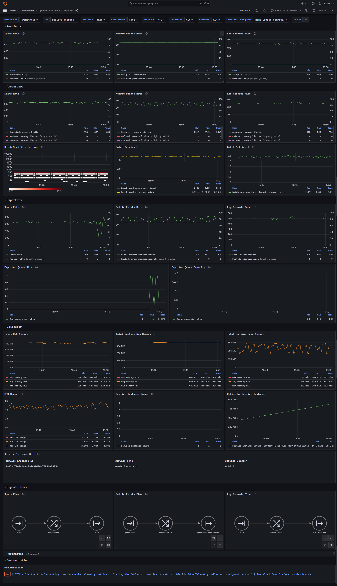
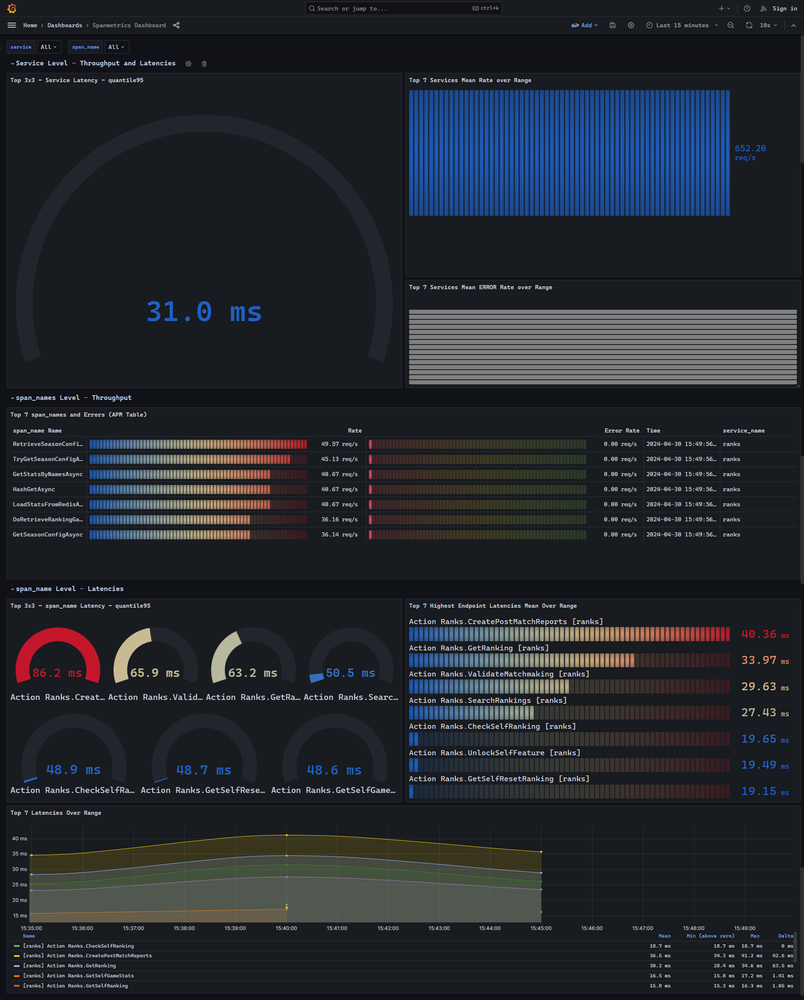
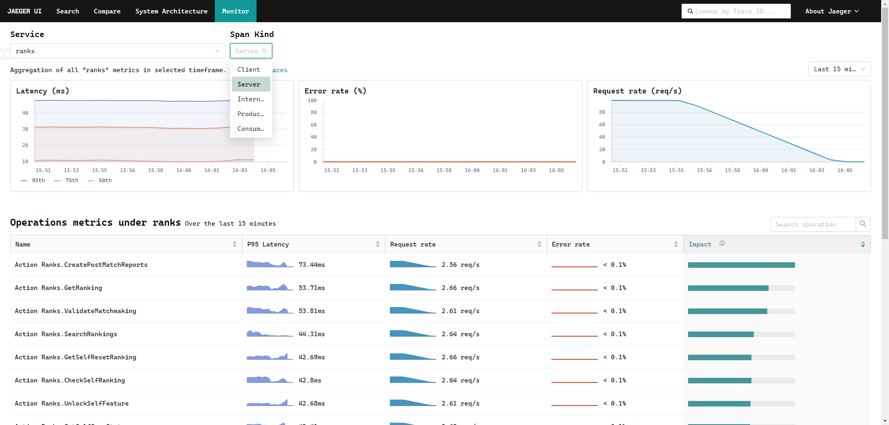
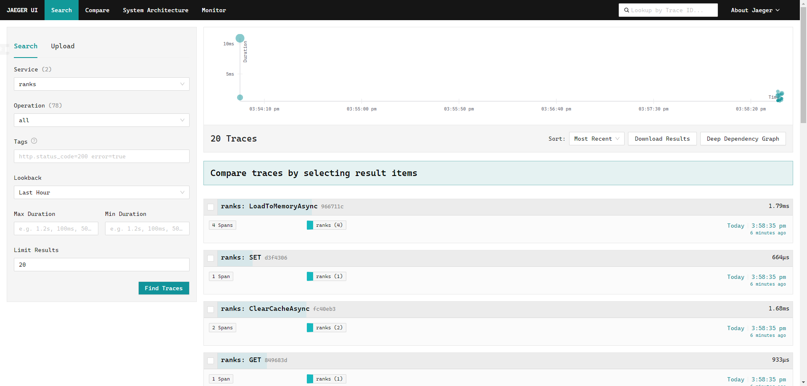
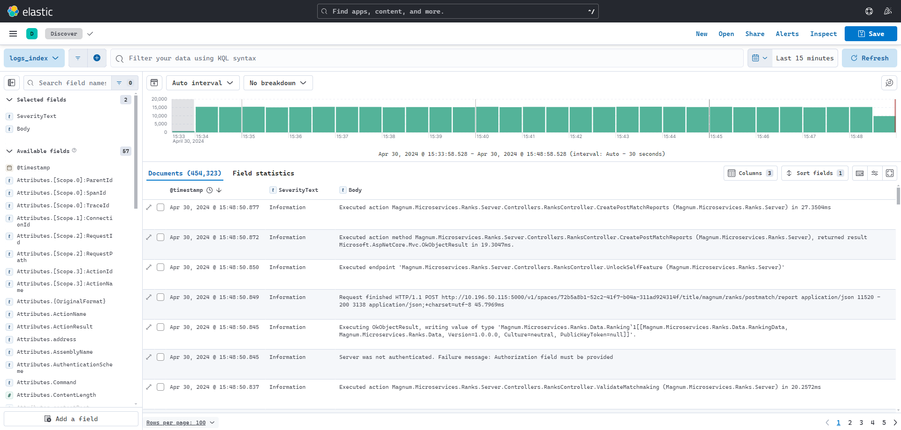

# OpenTelemetry For Debug

Build a monitoring cluster for debugging purposes based on [OpenTelemetry](https://opentelemetry.io/).
The cluster provides [Grafana](https://grafana.com/), [Jeager](https://www.jaegertracing.io/), and [Kibana](https://www.elastic.co/cn/kibana).

## How to use

1. Change the value of `CLUSTER_IP` in file [`.env`](./.env) to the external IP of the computer where the docker will run.

    This is useful if docker is running inside WSL and you want to access it from Windows, change the `CLUSTER_IP` to the IP of WSL.

1. Start docker

    ```bash
    # Set up the Prometheus metrics scrape target
    # Prometheus will access the URL http://10.196.50.115:5000/metrics to retrieve metrics data
    export PROMETHEUS_SCRAPE_TARGETS='["10.196.50.115:5000"]'

    # Start cluster
    docker compose up -d

    # See logs
    docker compose logs -f
    ```

1. (Optional) Stop docker and cleanup

    ```bash
    # Shutdown cluster
    docker compose down
    ```

## Exported Ports

> The following ports can be modified in the file [`.env`](./.env).

| Port | Description | Example |
| :--: | :---------: | :-----: |
| 9090 | Prometheus UI | <http://localhost:9090> |
| 16686 | Jaeger Query UI | <http://localhost:16686> |
| 3000 | Grafana UI | <http://localhost:3000> |
| 9200 | Elasticsearch | <http://localhost:9200> |
| 5601 | Kibana | <http://localhost:5601> |
| 4317 | OTLP gRPC receiver | <http://localhost:4317> |
| 4318 | OTLP http receiver | <http://localhost:4318> |
| 55679 | [zpages](https://github.com/open-telemetry/opentelemetry-collector/blob/main/extension/zpagesextension/README.md) for opentelemetry collector | <http://localhost:55679/debug/servicez>, <http://localhost:55679/debug/tracez> |

## Screenshots











## Reference

1. <https://github.com/monitoringartist/opentelemetry-collector-monitoring>
1. <https://github.com/open-telemetry/opentelemetry-demo>
